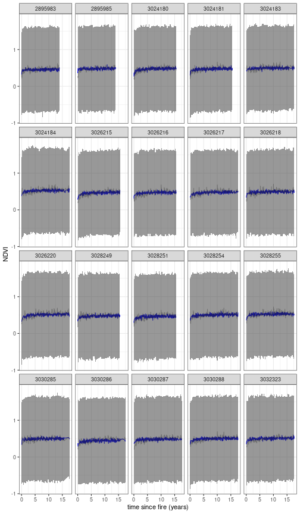

Model last updated at 2022-07-11 17:31:58.


# Model Overview (abridged)

We estimate the age of a site by calculating the years since the last fire. We then fit a curve to model the recovery of vegetation (measured using NDVI) as a function of it's age. An additional level models the parameters of the negative exponential curve as a function of environmental variables. This means that sites with similar environmental conditions should have similar recovery curves.

# Model Overview

The details are given in [@slingsby_near-real_2020;@wilson_climatic_2015], but in short what we do is estimate the age of a site by calculating the years since the last fire. We then fit a curve to model the recovery of vegetation (measured using NDVI) as a function of it's age. For this we use a negative exponential curve with the following form:

$$\mu_{i,t}=\alpha_i+\gamma_i\Big(1-e^{-\frac{age_{i,t}}{\lambda_i}}\Big)$$

where $\mu_{i,t}$ is the expected NDVI for site $i$ at time $t$

The observed greenness $NDVI_{i,t}$  is assumed to follow a normal distribution with mean $\mu_{i,t}$
$$NDVI_{i,t}\sim\mathcal{N}(\mu_{i,t},\sigma_)$$

An additional level models the parameters of the negative exponential curve as a function of environmental variables. This means that sites with similar environmental conditions should have similar recovery curves. The full model also includes a sinusoidal term to capture seasonal variation, but lets keep it simple here.  


## Workflow

This repository was developed using the Targets framework as follows.


```
## Error in path.expand(path): invalid 'path' argument
```

## Results

### Environmental Controls on Ecosystem Recovery

These parameters represent the relationship of the following environmental variables to the recovery trajectory.


```
## Error in path.expand(path): invalid 'path' argument
```


## Recovery Trajectories

The plot below illustrates some example recovery trajectories. It currently just shows the top 20 cells with the most observations.



## Spatial Predictions

Maps of spatial parameters in the model.  


```
## Error in path.expand(path): invalid 'path' argument
```

## Park Information

<!--html_preserve--><div id="cgcdekdtuh" style="overflow-x:auto;overflow-y:auto;width:auto;height:auto;">
<style>html {
  font-family: -apple-system, BlinkMacSystemFont, 'Segoe UI', Roboto, Oxygen, Ubuntu, Cantarell, 'Helvetica Neue', 'Fira Sans', 'Droid Sans', Arial, sans-serif;
}

#cgcdekdtuh .gt_table {
  display: table;
  border-collapse: collapse;
  margin-left: auto;
  margin-right: auto;
  color: #333333;
  font-size: 16px;
  font-weight: normal;
  font-style: normal;
  background-color: #FFFFFF;
  width: auto;
  border-top-style: solid;
  border-top-width: 2px;
  border-top-color: #A8A8A8;
  border-right-style: none;
  border-right-width: 2px;
  border-right-color: #D3D3D3;
  border-bottom-style: solid;
  border-bottom-width: 2px;
  border-bottom-color: #A8A8A8;
  border-left-style: none;
  border-left-width: 2px;
  border-left-color: #D3D3D3;
}

#cgcdekdtuh .gt_heading {
  background-color: #FFFFFF;
  text-align: center;
  border-bottom-color: #FFFFFF;
  border-left-style: none;
  border-left-width: 1px;
  border-left-color: #D3D3D3;
  border-right-style: none;
  border-right-width: 1px;
  border-right-color: #D3D3D3;
}

#cgcdekdtuh .gt_title {
  color: #333333;
  font-size: 125%;
  font-weight: initial;
  padding-top: 4px;
  padding-bottom: 4px;
  padding-left: 5px;
  padding-right: 5px;
  border-bottom-color: #FFFFFF;
  border-bottom-width: 0;
}

#cgcdekdtuh .gt_subtitle {
  color: #333333;
  font-size: 85%;
  font-weight: initial;
  padding-top: 0;
  padding-bottom: 6px;
  padding-left: 5px;
  padding-right: 5px;
  border-top-color: #FFFFFF;
  border-top-width: 0;
}

#cgcdekdtuh .gt_bottom_border {
  border-bottom-style: solid;
  border-bottom-width: 2px;
  border-bottom-color: #D3D3D3;
}

#cgcdekdtuh .gt_col_headings {
  border-top-style: solid;
  border-top-width: 2px;
  border-top-color: #D3D3D3;
  border-bottom-style: solid;
  border-bottom-width: 2px;
  border-bottom-color: #D3D3D3;
  border-left-style: none;
  border-left-width: 1px;
  border-left-color: #D3D3D3;
  border-right-style: none;
  border-right-width: 1px;
  border-right-color: #D3D3D3;
}

#cgcdekdtuh .gt_col_heading {
  color: #333333;
  background-color: #FFFFFF;
  font-size: 100%;
  font-weight: normal;
  text-transform: inherit;
  border-left-style: none;
  border-left-width: 1px;
  border-left-color: #D3D3D3;
  border-right-style: none;
  border-right-width: 1px;
  border-right-color: #D3D3D3;
  vertical-align: bottom;
  padding-top: 5px;
  padding-bottom: 6px;
  padding-left: 5px;
  padding-right: 5px;
  overflow-x: hidden;
}

#cgcdekdtuh .gt_column_spanner_outer {
  color: #333333;
  background-color: #FFFFFF;
  font-size: 100%;
  font-weight: normal;
  text-transform: inherit;
  padding-top: 0;
  padding-bottom: 0;
  padding-left: 4px;
  padding-right: 4px;
}

#cgcdekdtuh .gt_column_spanner_outer:first-child {
  padding-left: 0;
}

#cgcdekdtuh .gt_column_spanner_outer:last-child {
  padding-right: 0;
}

#cgcdekdtuh .gt_column_spanner {
  border-bottom-style: solid;
  border-bottom-width: 2px;
  border-bottom-color: #D3D3D3;
  vertical-align: bottom;
  padding-top: 5px;
  padding-bottom: 5px;
  overflow-x: hidden;
  display: inline-block;
  width: 100%;
}

#cgcdekdtuh .gt_group_heading {
  padding-top: 8px;
  padding-bottom: 8px;
  padding-left: 5px;
  padding-right: 5px;
  color: #333333;
  background-color: #FFFFFF;
  font-size: 100%;
  font-weight: initial;
  text-transform: inherit;
  border-top-style: solid;
  border-top-width: 2px;
  border-top-color: #D3D3D3;
  border-bottom-style: solid;
  border-bottom-width: 2px;
  border-bottom-color: #D3D3D3;
  border-left-style: none;
  border-left-width: 1px;
  border-left-color: #D3D3D3;
  border-right-style: none;
  border-right-width: 1px;
  border-right-color: #D3D3D3;
  vertical-align: middle;
}

#cgcdekdtuh .gt_empty_group_heading {
  padding: 0.5px;
  color: #333333;
  background-color: #FFFFFF;
  font-size: 100%;
  font-weight: initial;
  border-top-style: solid;
  border-top-width: 2px;
  border-top-color: #D3D3D3;
  border-bottom-style: solid;
  border-bottom-width: 2px;
  border-bottom-color: #D3D3D3;
  vertical-align: middle;
}

#cgcdekdtuh .gt_from_md > :first-child {
  margin-top: 0;
}

#cgcdekdtuh .gt_from_md > :last-child {
  margin-bottom: 0;
}

#cgcdekdtuh .gt_row {
  padding-top: 8px;
  padding-bottom: 8px;
  padding-left: 5px;
  padding-right: 5px;
  margin: 10px;
  border-top-style: solid;
  border-top-width: 1px;
  border-top-color: #D3D3D3;
  border-left-style: none;
  border-left-width: 1px;
  border-left-color: #D3D3D3;
  border-right-style: none;
  border-right-width: 1px;
  border-right-color: #D3D3D3;
  vertical-align: middle;
  overflow-x: hidden;
}

#cgcdekdtuh .gt_stub {
  color: #333333;
  background-color: #FFFFFF;
  font-size: 100%;
  font-weight: initial;
  text-transform: inherit;
  border-right-style: solid;
  border-right-width: 2px;
  border-right-color: #D3D3D3;
  padding-left: 5px;
  padding-right: 5px;
}

#cgcdekdtuh .gt_stub_row_group {
  color: #333333;
  background-color: #FFFFFF;
  font-size: 100%;
  font-weight: initial;
  text-transform: inherit;
  border-right-style: solid;
  border-right-width: 2px;
  border-right-color: #D3D3D3;
  padding-left: 5px;
  padding-right: 5px;
  vertical-align: top;
}

#cgcdekdtuh .gt_row_group_first td {
  border-top-width: 2px;
}

#cgcdekdtuh .gt_summary_row {
  color: #333333;
  background-color: #FFFFFF;
  text-transform: inherit;
  padding-top: 8px;
  padding-bottom: 8px;
  padding-left: 5px;
  padding-right: 5px;
}

#cgcdekdtuh .gt_first_summary_row {
  border-top-style: solid;
  border-top-color: #D3D3D3;
}

#cgcdekdtuh .gt_first_summary_row.thick {
  border-top-width: 2px;
}

#cgcdekdtuh .gt_last_summary_row {
  padding-top: 8px;
  padding-bottom: 8px;
  padding-left: 5px;
  padding-right: 5px;
  border-bottom-style: solid;
  border-bottom-width: 2px;
  border-bottom-color: #D3D3D3;
}

#cgcdekdtuh .gt_grand_summary_row {
  color: #333333;
  background-color: #FFFFFF;
  text-transform: inherit;
  padding-top: 8px;
  padding-bottom: 8px;
  padding-left: 5px;
  padding-right: 5px;
}

#cgcdekdtuh .gt_first_grand_summary_row {
  padding-top: 8px;
  padding-bottom: 8px;
  padding-left: 5px;
  padding-right: 5px;
  border-top-style: double;
  border-top-width: 6px;
  border-top-color: #D3D3D3;
}

#cgcdekdtuh .gt_striped {
  background-color: rgba(128, 128, 128, 0.05);
}

#cgcdekdtuh .gt_table_body {
  border-top-style: solid;
  border-top-width: 2px;
  border-top-color: #D3D3D3;
  border-bottom-style: solid;
  border-bottom-width: 2px;
  border-bottom-color: #D3D3D3;
}

#cgcdekdtuh .gt_footnotes {
  color: #333333;
  background-color: #FFFFFF;
  border-bottom-style: none;
  border-bottom-width: 2px;
  border-bottom-color: #D3D3D3;
  border-left-style: none;
  border-left-width: 2px;
  border-left-color: #D3D3D3;
  border-right-style: none;
  border-right-width: 2px;
  border-right-color: #D3D3D3;
}

#cgcdekdtuh .gt_footnote {
  margin: 0px;
  font-size: 90%;
  padding-left: 4px;
  padding-right: 4px;
  padding-left: 5px;
  padding-right: 5px;
}

#cgcdekdtuh .gt_sourcenotes {
  color: #333333;
  background-color: #FFFFFF;
  border-bottom-style: none;
  border-bottom-width: 2px;
  border-bottom-color: #D3D3D3;
  border-left-style: none;
  border-left-width: 2px;
  border-left-color: #D3D3D3;
  border-right-style: none;
  border-right-width: 2px;
  border-right-color: #D3D3D3;
}

#cgcdekdtuh .gt_sourcenote {
  font-size: 90%;
  padding-top: 4px;
  padding-bottom: 4px;
  padding-left: 5px;
  padding-right: 5px;
}

#cgcdekdtuh .gt_left {
  text-align: left;
}

#cgcdekdtuh .gt_center {
  text-align: center;
}

#cgcdekdtuh .gt_right {
  text-align: right;
  font-variant-numeric: tabular-nums;
}

#cgcdekdtuh .gt_font_normal {
  font-weight: normal;
}

#cgcdekdtuh .gt_font_bold {
  font-weight: bold;
}

#cgcdekdtuh .gt_font_italic {
  font-style: italic;
}

#cgcdekdtuh .gt_super {
  font-size: 65%;
}

#cgcdekdtuh .gt_two_val_uncert {
  display: inline-block;
  line-height: 1em;
  text-align: right;
  font-size: 60%;
  vertical-align: -0.25em;
  margin-left: 0.1em;
}

#cgcdekdtuh .gt_footnote_marks {
  font-style: italic;
  font-weight: normal;
  font-size: 75%;
  vertical-align: 0.4em;
}

#cgcdekdtuh .gt_asterisk {
  font-size: 100%;
  vertical-align: 0;
}

#cgcdekdtuh .gt_slash_mark {
  font-size: 0.7em;
  line-height: 0.7em;
  vertical-align: 0.15em;
}

#cgcdekdtuh .gt_fraction_numerator {
  font-size: 0.6em;
  line-height: 0.6em;
  vertical-align: 0.45em;
}

#cgcdekdtuh .gt_fraction_denominator {
  font-size: 0.6em;
  line-height: 0.6em;
  vertical-align: -0.05em;
}
</style>
<table class="gt_table">
  
  <thead class="gt_col_headings">
    <tr>
      <th class="gt_col_heading gt_columns_bottom_border gt_center" rowspan="1" colspan="1">park</th>
    </tr>
  </thead>
  <tbody class="gt_table_body">
    <tr><td class="gt_row gt_center"><a href="https://adamwilsonlab.github.io/emma_report/reports/report.Addo-Elephant_National_Park.html">Addo-Elephant National Park</a></td></tr>
    <tr><td class="gt_row gt_center"><a href="https://adamwilsonlab.github.io/emma_report/reports/report.Agulhas_National_Park.html">Agulhas National Park</a></td></tr>
    <tr><td class="gt_row gt_center"><a href="https://adamwilsonlab.github.io/emma_report/reports/report.Anysberg_Nature_Reserve.html">Anysberg Nature Reserve</a></td></tr>
    <tr><td class="gt_row gt_center"><a href="https://adamwilsonlab.github.io/emma_report/reports/report.Babilonstoring_Nature_Reserve_Complex.html">Babilonstoring Nature Reserve Complex</a></td></tr>
    <tr><td class="gt_row gt_center"><a href="https://adamwilsonlab.github.io/emma_report/reports/report.Bird_Island_Nature_Reserve_Complex.html">Bird Island Nature Reserve Complex</a></td></tr>
    <tr><td class="gt_row gt_center"><a href="https://adamwilsonlab.github.io/emma_report/reports/report.Bontebok_National_Park.html">Bontebok National Park</a></td></tr>
    <tr><td class="gt_row gt_center"><a href="https://adamwilsonlab.github.io/emma_report/reports/report.Cederberg_Nature_Reserve_Complex.html">Cederberg Nature Reserve Complex</a></td></tr>
    <tr><td class="gt_row gt_center"><a href="https://adamwilsonlab.github.io/emma_report/reports/report.Dassen_Coastal_Complex.html">Dassen Coastal Complex</a></td></tr>
    <tr><td class="gt_row gt_center"><a href="https://adamwilsonlab.github.io/emma_report/reports/report.Dassen_Island_Nature_Reserve.html">Dassen Island Nature Reserve</a></td></tr>
    <tr><td class="gt_row gt_center"><a href="https://adamwilsonlab.github.io/emma_report/reports/report.De_Hoop_Nature_Reserve_Complex.html">De Hoop Nature Reserve Complex</a></td></tr>
    <tr><td class="gt_row gt_center"><a href="https://adamwilsonlab.github.io/emma_report/reports/report.De_Mond_Nature_Reserve_Complex.html">De Mond Nature Reserve Complex</a></td></tr>
    <tr><td class="gt_row gt_center"><a href="https://adamwilsonlab.github.io/emma_report/reports/report.Driftsands_Nature_Reserve.html">Driftsands Nature Reserve</a></td></tr>
    <tr><td class="gt_row gt_center"><a href="https://adamwilsonlab.github.io/emma_report/reports/report.Dyer_Island_Nature_Reserve_Complex.html">Dyer Island Nature Reserve Complex</a></td></tr>
    <tr><td class="gt_row gt_center"><a href="https://adamwilsonlab.github.io/emma_report/reports/report.Gamkaberg_Nature_Reserve_Complex.html">Gamkaberg Nature Reserve Complex</a></td></tr>
    <tr><td class="gt_row gt_center"><a href="https://adamwilsonlab.github.io/emma_report/reports/report.Garden_Route_National_Park.html">Garden Route National Park</a></td></tr>
    <tr><td class="gt_row gt_center"><a href="https://adamwilsonlab.github.io/emma_report/reports/report.Geelkrans_Nature_Reserve_Complex.html">Geelkrans Nature Reserve Complex</a></td></tr>
    <tr><td class="gt_row gt_center"><a href="https://adamwilsonlab.github.io/emma_report/reports/report.Goukamma_Nature_Reserve_Complex.html">Goukamma Nature Reserve Complex</a></td></tr>
    <tr><td class="gt_row gt_center"><a href="https://adamwilsonlab.github.io/emma_report/reports/report.Grootvadersbos_Nature_Reserve_Complex.html">Grootvadersbos Nature Reserve Complex</a></td></tr>
    <tr><td class="gt_row gt_center"><a href="https://adamwilsonlab.github.io/emma_report/reports/report.Grootwinterhoek_Nature_Reserve.html">Grootwinterhoek Nature Reserve</a></td></tr>
    <tr><td class="gt_row gt_center"><a href="https://adamwilsonlab.github.io/emma_report/reports/report.Hottentots_Holland_Nature_Reserve_Complex.html">Hottentots Holland Nature Reserve Complex</a></td></tr>
    <tr><td class="gt_row gt_center"><a href="https://adamwilsonlab.github.io/emma_report/reports/report.Islands_and_Rocks_Complex.html">Islands and Rocks Complex</a></td></tr>
    <tr><td class="gt_row gt_center"><a href="https://adamwilsonlab.github.io/emma_report/reports/report.Kammanassie_Nature_Reserve.html">Kammanassie Nature Reserve</a></td></tr>
    <tr><td class="gt_row gt_center"><a href="https://adamwilsonlab.github.io/emma_report/reports/report.Karoo_National_Park.html">Karoo National Park</a></td></tr>
    <tr><td class="gt_row gt_center"><a href="https://adamwilsonlab.github.io/emma_report/reports/report.Keurbooms_River_Nature_Reserve_Complex.html">Keurbooms River Nature Reserve Complex</a></td></tr>
    <tr><td class="gt_row gt_center"><a href="https://adamwilsonlab.github.io/emma_report/reports/report.Knersvlakte_Nature_Reserve_Complex.html">Knersvlakte Nature Reserve Complex</a></td></tr>
    <tr><td class="gt_row gt_center"><a href="https://adamwilsonlab.github.io/emma_report/reports/report.Kogelberg_Nature_Reserve_Complex.html">Kogelberg Nature Reserve Complex</a></td></tr>
    <tr><td class="gt_row gt_center"><a href="https://adamwilsonlab.github.io/emma_report/reports/report.Limietberg_Nature_Reserve_Complex.html">Limietberg Nature Reserve Complex</a></td></tr>
    <tr><td class="gt_row gt_center"><a href="https://adamwilsonlab.github.io/emma_report/reports/report.Marloth_Nature_Reserve_Complex.html">Marloth Nature Reserve Complex</a></td></tr>
    <tr><td class="gt_row gt_center"><a href="https://adamwilsonlab.github.io/emma_report/reports/report.Namaqua_National_Park.html">Namaqua National Park</a></td></tr>
    <tr><td class="gt_row gt_center"><a href="https://adamwilsonlab.github.io/emma_report/reports/report.Other.html">Other</a></td></tr>
    <tr><td class="gt_row gt_center"><a href="https://adamwilsonlab.github.io/emma_report/reports/report.Outeniqua_Nature_Reserve_Complex.html">Outeniqua Nature Reserve Complex</a></td></tr>
    <tr><td class="gt_row gt_center"><a href="https://adamwilsonlab.github.io/emma_report/reports/report.Richtersveld_National_Park.html">Richtersveld National Park</a></td></tr>
    <tr><td class="gt_row gt_center"><a href="https://adamwilsonlab.github.io/emma_report/reports/report.Riverlands_Nature_Reserve_Complex.html">Riverlands Nature Reserve Complex</a></td></tr>
    <tr><td class="gt_row gt_center"><a href="https://adamwilsonlab.github.io/emma_report/reports/report.Robberg_Nature_Reserve_Complex.html">Robberg Nature Reserve Complex</a></td></tr>
    <tr><td class="gt_row gt_center"><a href="https://adamwilsonlab.github.io/emma_report/reports/report.Rocherpan_Nature_Reserve_Complex.html">Rocherpan Nature Reserve Complex</a></td></tr>
    <tr><td class="gt_row gt_center"><a href="https://adamwilsonlab.github.io/emma_report/reports/report.Salmonsdam_Nature_Reserve.html">Salmonsdam Nature Reserve</a></td></tr>
    <tr><td class="gt_row gt_center"><a href="https://adamwilsonlab.github.io/emma_report/reports/report.Swartberg_Nature_Reserve_Complex.html">Swartberg Nature Reserve Complex</a></td></tr>
    <tr><td class="gt_row gt_center"><a href="https://adamwilsonlab.github.io/emma_report/reports/report.Table_Mountain_National_Park.html">Table Mountain National Park</a></td></tr>
    <tr><td class="gt_row gt_center"><a href="https://adamwilsonlab.github.io/emma_report/reports/report.Tankwa-Karoo_National_Park.html">Tankwa-Karoo National Park</a></td></tr>
    <tr><td class="gt_row gt_center"><a href="https://adamwilsonlab.github.io/emma_report/reports/report.Vrolijkheid_Nature_Reserve_Complex.html">Vrolijkheid Nature Reserve Complex</a></td></tr>
    <tr><td class="gt_row gt_center"><a href="https://adamwilsonlab.github.io/emma_report/reports/report.Walker_Bay_Nature_Reserve_Complex.html">Walker Bay Nature Reserve Complex</a></td></tr>
    <tr><td class="gt_row gt_center"><a href="https://adamwilsonlab.github.io/emma_report/reports/report.Waterval_Nature_Reserve_Complex.html">Waterval Nature Reserve Complex</a></td></tr>
    <tr><td class="gt_row gt_center"><a href="https://adamwilsonlab.github.io/emma_report/reports/report.West_Coast_National_Park.html">West Coast National Park</a></td></tr>
  </tbody>
  
  
</table>
</div><!--/html_preserve-->

