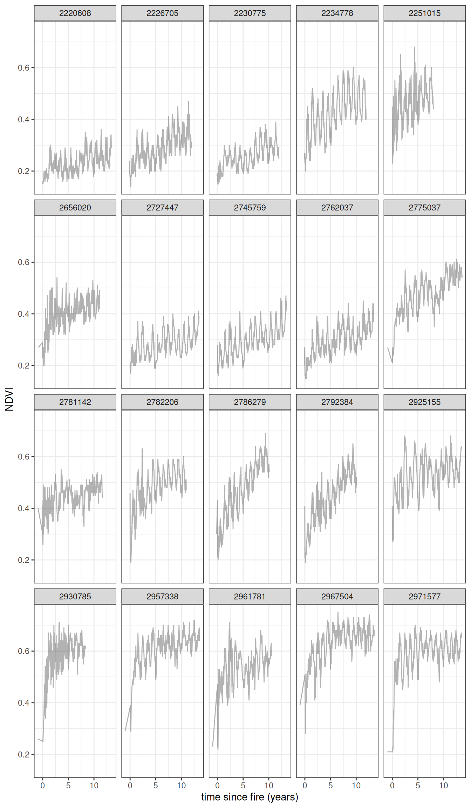

Model last updated at 2025-05-31 00:49:23.843963.


# Model Overview

The details are given in [@slingsby_near-real_2020; @wilson_climatic_2015], but in short what we do is estimate the age of a site by calculating the years since the last fire. We then fit a curve to model the recovery of vegetation (measured using NDVI) as a function of it's age. For this we use a negative exponential curve with the following form:

$$\mu_{i,t}=\alpha_i+\gamma_i\Big(1-e^{-\frac{age_{i,t}}{\lambda_i}}\Big)$$

where $\mu_{i,t}$ is the expected NDVI for site $i$ at time $t$

The observed greenness $NDVI_{i,t}$ is assumed to follow a normal distribution with mean $\mu_{i,t}$ $$NDVI_{i,t}\sim\mathcal{N}(\mu_{i,t},\sigma_)$$

An additional level models the parameters of the negative exponential curve as a function of environmental variables. This means that sites with similar environmental conditions should have similar recovery curves.

## Results

### Environmental Controls on Ecosystem Recovery

These parameters represent the relationship of the following environmental variables to the recovery trajectory.


::: {.cell}
::: {.cell-output-display}

```{=html}
<div class="plotly html-widget html-fill-item" id="htmlwidget-f7d62bb18999a810775d" style="width:100%;height:464px;"></div>
<script type="application/json" data-for="htmlwidget-f7d62bb18999a810775d">{"x":{"data":[{"x":[0.079385900000000009,-0.090657849999999998,-0.0068081649999999997,-0.029595900000000001,0.085586999999999996],"y":[3,2,4,1,5],"text":["median:  0.0794 <br />xname: Mean_July_Precipitation<br />q5:  0.015137585<br />q95:  0.150511850","median: -0.0907 <br />xname: Max_Air_Temperature_Warmest<br />q5: -0.159897250<br />q95: -0.038467445","median: -0.00681<br />xname: Min_Air_Temperature_Coldest<br />q5: -0.066976090<br />q95:  0.049708240","median: -0.0296 <br />xname: Cloud_Seasonal_Concentration<br />q5: -0.097177225<br />q95:  0.039795540","median:  0.0856 <br />xname: Topographic_Diversity<br />q5:  0.024412420<br />q95:  0.127167950"],"type":"scatter","mode":"lines+markers","opacity":1,"line":{"color":"transparent"},"error_x":{"array":[0.071125949999999993,0.052190404999999995,0.056516404999999985,0.069391439999999971,0.041580949999999978],"arrayminus":[0.064248315000000014,0.06923940000000002,0.060167925000000004,0.067581324999999998,0.061174579999999992],"type":"data","width":0,"symmetric":false,"color":"rgba(0,0,0,1)"},"showlegend":false,"xaxis":"x","yaxis":"y","hoverinfo":"text","marker":{"autocolorscale":false,"color":"rgba(0,0,0,1)","opacity":1,"size":1.8897637795275593,"symbol":"circle","line":{"width":3.7795275590551185,"color":"rgba(0,0,0,1)"}},"hoveron":"points","frame":null},{"x":[0.0098304599999999992,-0.083754200000000001,0.040704950000000004,-0.020113949999999998,0.060999650000000002],"y":[3,2,4,1,5],"text":["median:  0.00983<br />xname: Mean_July_Precipitation<br />q5: -0.001567641<br />q95:  0.019665065","median: -0.0838 <br />xname: Max_Air_Temperature_Warmest<br />q5: -0.099439630<br />q95: -0.074662775","median:  0.0407 <br />xname: Min_Air_Temperature_Coldest<br />q5:  0.030733625<br />q95:  0.055757460","median: -0.0201 <br />xname: Cloud_Seasonal_Concentration<br />q5: -0.032738545<br />q95: -0.003504245","median:  0.0610 <br />xname: Topographic_Diversity<br />q5:  0.055312075<br />q95:  0.072546970"],"type":"scatter","mode":"lines+markers","opacity":1,"line":{"color":"transparent"},"error_x":{"array":[0.0098346050000000032,0.0090914250000000002,0.015052509999999991,0.016609705449999991,0.011547319999999986],"arrayminus":[0.011398100999999999,0.01568543,0.0099713250000000066,0.012624595000000002,0.0056875750000000003],"type":"data","width":0,"symmetric":false,"color":"rgba(0,0,0,1)"},"showlegend":false,"xaxis":"x2","yaxis":"y","hoverinfo":"text","marker":{"autocolorscale":false,"color":"rgba(0,0,0,1)","opacity":1,"size":1.8897637795275593,"symbol":"circle","line":{"width":3.7795275590551185,"color":"rgba(0,0,0,1)"}},"hoveron":"points","frame":null},{"x":[-0.14151049999999998,-2.007765,-0.71400249999999998,-0.150038,1.07298],"y":[3,2,4,1,5],"text":["median: -0.142  <br />xname: Mean_July_Precipitation<br />q5: -0.726933550<br />q95:  0.618486050","median: -2.01   <br />xname: Max_Air_Temperature_Warmest<br />q5: -2.751700500<br />q95: -1.423406000","median: -0.714  <br />xname: Min_Air_Temperature_Coldest<br />q5: -1.550489500<br />q95: -0.203471895","median: -0.150  <br />xname: Cloud_Seasonal_Concentration<br />q5: -0.927574700<br />q95:  0.578090150","median:  1.07   <br />xname: Topographic_Diversity<br />q5:  0.696646500<br />q95:  1.412602500"],"type":"scatter","mode":"lines+markers","opacity":1,"line":{"color":"transparent"},"error_x":{"array":[0.75999654999999977,0.58435900000000007,0.51053060499999958,0.72812814999999997,0.33962249999999972],"arrayminus":[0.58542305000000006,0.74393550000000008,0.83648699999999987,0.77753669999999986,0.37633349999999999],"type":"data","width":0,"symmetric":false,"color":"rgba(0,0,0,1)"},"showlegend":false,"xaxis":"x3","yaxis":"y","hoverinfo":"text","marker":{"autocolorscale":false,"color":"rgba(0,0,0,1)","opacity":1,"size":1.8897637795275593,"symbol":"circle","line":{"width":3.7795275590551185,"color":"rgba(0,0,0,1)"}},"hoveron":"points","frame":null},{"x":[0,0],"y":[0.40000000000000002,5.5999999999999996],"text":"xintercept: 0","type":"scatter","mode":"lines","line":{"width":1.8897637795275593,"color":"rgba(190,190,190,1)","dash":"solid"},"hoveron":"points","showlegend":false,"xaxis":"x","yaxis":"y","hoverinfo":"text","frame":null},{"x":[0,0],"y":[0.40000000000000002,5.5999999999999996],"text":"xintercept: 0","type":"scatter","mode":"lines","line":{"width":1.8897637795275593,"color":"rgba(190,190,190,1)","dash":"solid"},"hoveron":"points","showlegend":false,"xaxis":"x2","yaxis":"y","hoverinfo":"text","frame":null},{"x":[0,0],"y":[0.40000000000000002,5.5999999999999996],"text":"xintercept: 0","type":"scatter","mode":"lines","line":{"width":1.8897637795275593,"color":"rgba(190,190,190,1)","dash":"solid"},"hoveron":"points","showlegend":false,"xaxis":"x3","yaxis":"y","hoverinfo":"text","frame":null}],"layout":{"margin":{"t":37.917808219178085,"r":7.3059360730593621,"b":40.182648401826491,"l":189.22374429223748},"plot_bgcolor":"rgba(235,235,235,1)","paper_bgcolor":"rgba(255,255,255,1)","font":{"color":"rgba(0,0,0,1)","family":"","size":14.611872146118724},"xaxis":{"domain":[0,0.32925636007827785],"automargin":true,"type":"linear","autorange":false,"range":[-2.9599156500000001,1.6208176499999998],"tickmode":"array","ticktext":["-2","-1","0","1"],"tickvals":[-2,-1,0,1],"categoryorder":"array","categoryarray":["-2","-1","0","1"],"nticks":null,"ticks":"outside","tickcolor":"rgba(51,51,51,1)","ticklen":3.6529680365296811,"tickwidth":0.66417600664176002,"showticklabels":true,"tickfont":{"color":"rgba(77,77,77,1)","family":"","size":11.68949771689498},"tickangle":-0,"showline":false,"linecolor":null,"linewidth":0,"showgrid":true,"gridcolor":"rgba(255,255,255,1)","gridwidth":0.66417600664176002,"zeroline":false,"anchor":"y","title":"","hoverformat":".2f"},"annotations":[{"text":"Beta (regression coefficient +/- 95% CI)","x":0.5,"y":0,"showarrow":false,"ax":0,"ay":0,"font":{"color":"rgba(0,0,0,1)","family":"","size":14.611872146118724},"xref":"paper","yref":"paper","textangle":-0,"xanchor":"center","yanchor":"top","annotationType":"axis","yshift":-21.917808219178088},{"text":"Environmental Variable","x":0,"y":0.5,"showarrow":false,"ax":0,"ay":0,"font":{"color":"rgba(0,0,0,1)","family":"","size":14.611872146118724},"xref":"paper","yref":"paper","textangle":-90,"xanchor":"right","yanchor":"center","annotationType":"axis","xshift":-173.88127853881281},{"text":"A_beta","x":0.16462818003913893,"y":1,"showarrow":false,"ax":0,"ay":0,"font":{"color":"rgba(26,26,26,1)","family":"","size":11.68949771689498},"xref":"paper","yref":"paper","textangle":-0,"xanchor":"center","yanchor":"bottom"},{"text":"gamma_beta","x":0.5,"y":1,"showarrow":false,"ax":0,"ay":0,"font":{"color":"rgba(26,26,26,1)","family":"","size":11.68949771689498},"xref":"paper","yref":"paper","textangle":-0,"xanchor":"center","yanchor":"bottom"},{"text":"lambda_beta","x":0.83537181996086107,"y":1,"showarrow":false,"ax":0,"ay":0,"font":{"color":"rgba(26,26,26,1)","family":"","size":11.68949771689498},"xref":"paper","yref":"paper","textangle":-0,"xanchor":"center","yanchor":"bottom"}],"yaxis":{"domain":[0,1],"automargin":true,"type":"linear","autorange":false,"range":[0.40000000000000002,5.5999999999999996],"tickmode":"array","ticktext":["Cloud_Seasonal_Concentration","Max_Air_Temperature_Warmest","Mean_July_Precipitation","Min_Air_Temperature_Coldest","Topographic_Diversity"],"tickvals":[1,2,3,4,5],"categoryorder":"array","categoryarray":["Cloud_Seasonal_Concentration","Max_Air_Temperature_Warmest","Mean_July_Precipitation","Min_Air_Temperature_Coldest","Topographic_Diversity"],"nticks":null,"ticks":"outside","tickcolor":"rgba(51,51,51,1)","ticklen":3.6529680365296811,"tickwidth":0.66417600664176002,"showticklabels":true,"tickfont":{"color":"rgba(77,77,77,1)","family":"","size":11.68949771689498},"tickangle":-0,"showline":false,"linecolor":null,"linewidth":0,"showgrid":true,"gridcolor":"rgba(255,255,255,1)","gridwidth":0.66417600664176002,"zeroline":false,"anchor":"x","title":"","hoverformat":".2f"},"shapes":[{"type":"rect","fillcolor":null,"line":{"color":null,"width":0,"linetype":[]},"yref":"paper","xref":"paper","x0":0,"x1":0.32925636007827785,"y0":0,"y1":1},{"type":"rect","fillcolor":"rgba(217,217,217,1)","line":{"color":"transparent","width":0.66417600664176002,"linetype":"solid"},"yref":"paper","xref":"paper","x0":0,"x1":0.32925636007827785,"y0":0,"y1":23.37899543378996,"yanchor":1,"ysizemode":"pixel"},{"type":"rect","fillcolor":null,"line":{"color":null,"width":0,"linetype":[]},"yref":"paper","xref":"paper","x0":0.33741030658838878,"x1":0.66258969341161122,"y0":0,"y1":1},{"type":"rect","fillcolor":"rgba(217,217,217,1)","line":{"color":"transparent","width":0.66417600664176002,"linetype":"solid"},"yref":"paper","xref":"paper","x0":0.33741030658838878,"x1":0.66258969341161122,"y0":0,"y1":23.37899543378996,"yanchor":1,"ysizemode":"pixel"},{"type":"rect","fillcolor":null,"line":{"color":null,"width":0,"linetype":[]},"yref":"paper","xref":"paper","x0":0.67074363992172203,"x1":1,"y0":0,"y1":1},{"type":"rect","fillcolor":"rgba(217,217,217,1)","line":{"color":"transparent","width":0.66417600664176002,"linetype":"solid"},"yref":"paper","xref":"paper","x0":0.67074363992172203,"x1":1,"y0":0,"y1":23.37899543378996,"yanchor":1,"ysizemode":"pixel"}],"xaxis2":{"type":"linear","autorange":false,"range":[-2.9599156500000001,1.6208176499999998],"tickmode":"array","ticktext":["-2","-1","0","1"],"tickvals":[-2,-1,0,1],"categoryorder":"array","categoryarray":["-2","-1","0","1"],"nticks":null,"ticks":"outside","tickcolor":"rgba(51,51,51,1)","ticklen":3.6529680365296811,"tickwidth":0.66417600664176002,"showticklabels":true,"tickfont":{"color":"rgba(77,77,77,1)","family":"","size":11.68949771689498},"tickangle":-0,"showline":false,"linecolor":null,"linewidth":0,"showgrid":true,"domain":[0.33741030658838878,0.66258969341161122],"gridcolor":"rgba(255,255,255,1)","gridwidth":0.66417600664176002,"zeroline":false,"anchor":"y","title":"","hoverformat":".2f"},"xaxis3":{"type":"linear","autorange":false,"range":[-2.9599156500000001,1.6208176499999998],"tickmode":"array","ticktext":["-2","-1","0","1"],"tickvals":[-2,-1,0,1],"categoryorder":"array","categoryarray":["-2","-1","0","1"],"nticks":null,"ticks":"outside","tickcolor":"rgba(51,51,51,1)","ticklen":3.6529680365296811,"tickwidth":0.66417600664176002,"showticklabels":true,"tickfont":{"color":"rgba(77,77,77,1)","family":"","size":11.68949771689498},"tickangle":-0,"showline":false,"linecolor":null,"linewidth":0,"showgrid":true,"domain":[0.67074363992172203,1],"gridcolor":"rgba(255,255,255,1)","gridwidth":0.66417600664176002,"zeroline":false,"anchor":"y","title":"","hoverformat":".2f"},"showlegend":false,"legend":{"bgcolor":"rgba(255,255,255,1)","bordercolor":"transparent","borderwidth":1.8897637795275593,"font":{"color":"rgba(0,0,0,1)","family":"","size":11.68949771689498}},"hovermode":"closest","barmode":"relative"},"config":{"doubleClick":"reset","modeBarButtonsToAdd":["hoverclosest","hovercompare"],"showSendToCloud":false},"source":"A","attrs":{"d2c4fa415bf":{"x":{},"y":{},"xmin":{},"xmax":{},"type":"scatter"},"d2c78f30f4a":{"xintercept":{}}},"cur_data":"d2c4fa415bf","visdat":{"d2c4fa415bf":["function (y) ","x"],"d2c78f30f4a":["function (y) ","x"]},"highlight":{"on":"plotly_click","persistent":false,"dynamic":false,"selectize":false,"opacityDim":0.20000000000000001,"selected":{"opacity":1},"debounce":0},"shinyEvents":["plotly_hover","plotly_click","plotly_selected","plotly_relayout","plotly_brushed","plotly_brushing","plotly_clickannotation","plotly_doubleclick","plotly_deselect","plotly_afterplot","plotly_sunburstclick"],"base_url":"https://plot.ly"},"evals":[],"jsHooks":[]}</script>
```

:::
:::


## Recovery Trajectories

The plot below illustrates some example recovery trajectories. It currently just shows the top 20 cells with the most observations.


::: {.cell}
::: {.cell-output-display}
{width=672}
:::
:::


## Spatial Predictions

Maps of spatial parameters in the model.


::: {.cell}

:::

